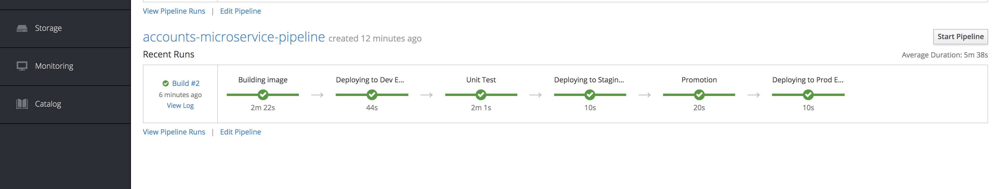

# Cumulus Bank Account Microservice Operator testt
<h1 align="center">
  <br>
  <a href="https://github.com/SaifRehman/mongo-rest-operator"></a>
  <br>
      Cumulus Bank Account Microservice Operator for Openshift
  <br>
  <br>
</h1>

<h4 align="center">Powered by Openshift and OperatorSDK</h4>

<p align="center">
  <a>
    
  </a>
</p>
<br>

## Install Operator on Openshift

1. clone the repoo
```
$ git clone https://github.com/cumulus-bank/Accounts-Microservice.git
```
2. install ***serviceaccount***, ***rolebinding***, ***role***, ***crd***, and ***operator***
```
$ oc apply -f deploy/service_account.yaml
$ oc apply -f deploy/role.yaml
$ oc apply -f deploy/role_binding.yaml
$ oc apply -f deploy/operator.yaml
$ oc apply -f deploy/crds/cumulusbank_v1alpha1_cumulusbankaccsvc_crd.yaml
```
## Deploy Cumulus Bank Account Microservice App
``` YAML
apiVersion: cumulusbank.com/v1alpha1
kind: CumulusBankAccSvc
metadata:
  name: accountsvc
spec:
  replicaCount: 2
  namespace: "kubeapp"
  mongodb: 
    host: "mongodb.kubeapp"
    username: "YWRtaW4="
    password: "YWRtaW4="
    secret: "aGVsbG8="
```
3. Apply these YAML configuration

## Cloud Native CI/CD Pipeline on RedHat Openshift

Openshift Pipeline is the native feature provided by Openshift. It leverages Jenkins to create CI/CD pipelines by using BuildConfig operator with Jenkins Strategy.

### CI/CD scenerio 

We are performing CI/CD Pipeline on Accounts Microservice for Cumulus Bank Application. Unit test has been written for Accounts Microservice using testing framework called **Jest** . Example to test if document has been successfully inserted ands validated in MongoDB, healthchecks, Getting correct validated output etc.

#### Some theory behind  unit testing in JavaScript

1. Health checks
``` JavaScript
const functions = {
  fetchHealthz: () =>
    axios
      .get("http://account-svc.cumulusbank:7000/healthz")
      .then(res => res.data)
      .catch(err => "error"),
};
module.exports = functions;
```
> Testing the function if the health output is ok.
``` JavaScript
test("checking health check api", () => {
  expect.assertions(1);
  return functions.fetchHealthz().then(data => {
    expect(data.success).toEqual("ok");
  });
});
```
#### Pipeline scenario 



1. The source code of the microservice shall reside in a repository like Github, Gitlab, Gogs, etc. First thing pipeline should do is build the Docker image from the Dockerfile provided in the source code.

2. In the second stage pipeline should deploy the image on Dev namespace

3. Third stage should perform unit test, intgration test, and test coverage. If all the test passes it shall go to the next stage

4. In the fourth stage, if all the tests has been passed, the application will be automatically promoted to Staging. Here UAT test will be performed before it moves to production 

5. If all UAT tests has been passed, the user will manually promote the application from staging to prodiction

#### Steps to setup this CI/CD pipeline 
0. Create **cumulusbank** , ***cumulusbankstage**, and  **cumulusbankprod** project. Then deploy mongodb in each project accordingly
1. clone the repo
```
$ git clone https://github.com/cumulus-bank/Accounts-Microservice.git
```
2. install ***serviceaccount***, ***rolebinding***, ***role***, ***crd***, and ***operator***
```
$ oc apply -f deploy/service_account.yaml
$ oc apply -f deploy/role.yaml
$ oc apply -f deploy/role_binding.yaml
$ oc apply -f deploy/operator.yaml
$ oc apply -f deploy/crds/cumulusbank_v1alpha1_cumulusbankaccsvc_crd.yaml
```
* Deploy Cumulus Bank Account Microservice (in Dev stage) in 

``` YAML
apiVersion: cumulusbank.com/v1alpha1
kind: CumulusBankAccSvc
metadata:
  name: accountsvc
spec:
  replicaCount: 2
  namespace: "cumulusbank"
  mongodb: 
    host: "mongodb.cumulusbank"
    username: "YWRtaW4="
    password: "YWRtaW4="
    secret: "aGVsbG8="
```

* Deploy Cumulus Bank Account Microservice (in Staging stage) in 

``` YAML
apiVersion: cumulusbank.com/v1alpha1
kind: CumulusBankAccSvc
metadata:
  name: accountsvc
spec:
  replicaCount: 2
  namespace: "cumulusbankstage"
  mongodb: 
    host: "mongodb.cumulusbankstage"
    username: "YWRtaW4="
    password: "YWRtaW4="
    secret: "aGVsbG8="
```

* Deploy Cumulus Bank Account Microservice (in Prod stage) in 

``` YAML
apiVersion: cumulusbank.com/v1alpha1
kind: CumulusBankAccSvc
metadata:
  name: accountsvc
spec:
  replicaCount: 2
  namespace: "cumulusbankprod"
  mongodb: 
    host: "mongodb.cumulusbankprod"
    username: "YWRtaW4="
    password: "YWRtaW4="
    secret: "aGVsbG8="
```
3. Configure RBACs in each project for jenkins to do its functionalities.

* Create Roles
``` YAML
apiVersion: authorization.openshift.io/v1
kind: ClusterRole
metadata:
  name: jenkins
rules:
- apiGroups:
  - ""
  resources:
  - pods
  - services
  - endpoints
  - events
  - configmaps
  - secrets
  - imagestreams
  - routes
  - buildconfigs
  - deploymentconfigs
  verbs:
  - '*'
- apiGroups:
  - ""
  - build.openshift.io
  - image.openshift.io
  resources:
  - "*"
  verbs:
  - "*"
- apiGroups:
  - ""
  resources:
  - "*"
  verbs:
  - "*"
- apiGroups:
  - "route.openshift.io"
  resources:
  - routes
  - routes/custom-host
  verbs:
  - '*'
- apiGroups:
  - "apps.openshift.io"
  resources:
  - deploymentconfigs
  verbs:
  - '*'
- apiGroups:
  - "build.openshift.io"
  resources:
  - buildconfigs
  verbs:
  - '*'
- apiGroups:
  - "image.openshift.io"
  resources:
  - "*"
  verbs:
  - '*'
- apiGroups:
  - apps
  resources:
  - deployments
  - daemonsets
  - replicasets
  - statefulsets
  - imagestreams
  - routes
  - buildconfigs
  - deploymentconfigs
  verbs:
  - '*'
- apiGroups:
  - ""
  resources:
  - pods
  verbs:
  - "*"
- apiGroups:
  - apps
  resources:
  - replicasets
  verbs:
  - get
```
* Deploy Rolebinding Dev (cumulusbank project)

```YAML
apiVersion: authorization.openshift.io/v1
groupNames: null
kind: RoleBinding
metadata:
  labels:
    app: jenkins-ephemeral
    template: jenkins-ephemeral-template
  name: jenkins_edit
  namespace: cumulusbank
roleRef:
  kind: Role
  name: jenkins
  apiGroup: authorization.openshift.io/v1
subjects:
- kind: ServiceAccount
  name: jenkins
userNames:
- system:serviceaccount:cumulusbank:jenkins
```

* Deploy Rolebinding Dev (cumulusbankstage project)

```YAML
apiVersion: authorization.openshift.io/v1
groupNames: null
kind: RoleBinding
metadata:
  labels:
    app: jenkins-ephemeral
    template: jenkins-ephemeral-template
  name: jenkins_edit
  namespace: cumulusbankstage
roleRef:
  kind: Role
  name: jenkins
  apiGroup: authorization.openshift.io/v1
subjects:
- kind: ServiceAccount
  name: jenkins
userNames:
- system:serviceaccount:cumulusbank:jenkins
```

* Deploy Rolebinding Dev (cumulusbankprod project)

```YAML
apiVersion: authorization.openshift.io/v1
groupNames: null
kind: RoleBinding
metadata:
  labels:
    app: jenkins-ephemeral
    template: jenkins-ephemeral-template
  name: jenkins_edit
  namespace: cumulusbankprod
roleRef:
  kind: Role
  name: jenkins
  apiGroup: authorization.openshift.io/v1
subjects:
- kind: ServiceAccount
  name: jenkins
userNames:
- system:serviceaccount:cumulusbank:jenkins
```
4. Create image streams in stage and prod project

* Create imagestream in cumulusbankstage project 
``` YAML
apiVersion: image.openshift.io/v1
kind: ImageStream
metadata:
  labels:
    app: account-svc
  name: account-svc-stage
  namespace: cumulusbankstage
``` 

* Create imagestream in prod project 
``` YAML
apiVersion: image.openshift.io/v1
kind: ImageStream
metadata:
  labels:
    app: account-svc
  name: account-svc-prod
  namespace: cumulusbankprod
``` 

#### Lets build the pipeline

We will use BuildConfig and JenkinsStrategy in BuildConfig to set up our CI/CD pipeline

1. Build Stage
```s
    stage ('Building image'){
      openshiftBuild(buildConfig: 'account-svc', showBuildLogs: 'true')
    }
```
2. Deploy to Dev stage

```s
  stage ('Deploying to Dev Environment'){
    openshiftDeploy(deploymentConfig: 'account-svc')
    sleep 10
  }
```
3. Test Stage

```s
          stage ('Unit Test'){
            openshift.withCluster() {
              openshift.withProject("cumulusbank") {
                 echo "Using project: ${openshift.project()}"
                 def dcObj = openshift.selector('dc', 'account-svc').object()
                 def podSelector = openshift.selector('pod', [deployment: "account-svc-${dcObj.status.latestVersion}"])
                 podSelector.withEach {
                    def podName = it.name()
                    def temparray = podName.split("/")
                    def onlyname = temparray[1]
                    echo "Running unit tests against ${onlyname}"
                    def execcommand = "oc exec -it ${onlyname} -- /bin/sh -c 'jest --no-color 2> /mnt/a.txt' "
                    script {
                      tempo = sh (script: execcommand, returnStdout: true).trim()
                    }
                    execcommand = "oc exec -it ${onlyname} -- /bin/sh -c 'cat /mnt/a.txt' "
                    echo "${execcommand}"
                    script {
                       tempo = sh (script: execcommand, returnStdout: true).trim()
                    }
                    def lastfinal = tempo
                    echo "${lastfinal}"
                    lastfinal = lastfinal.replaceAll("[\n\r]", "")
                    lastfinal = lastfinal.split(" ")
                    echo "${lastfinal}"
                    assert lastfinal.contains("constructor.PASS")
                 }
              }
            }
          }
```
4. Deploy to staging

```s
          stage('Deploying to Staging Env'){
            openshift.withCluster() {
              openshift.withProject("cumulusbank") {
                def execcommand = "oc tag cumulusbank/account-svc:latest cumulusbankstage/account-svc-staging:latest"
                script {
                   tempo = sh (script: execcommand, returnStdout: true).trim()
                }
                sleep 10
              }
            }
          }
```

5. Promote to Prod
```sh
          stage('Promotion'){
             timeout(time: 30, unit: 'DAYS') {
               input message: "Promote to Production?"
             }
          }
```

6. Deploy to Prod
```s
          stage('Deploying to Prod Env'){
            openshift.withCluster() {
              openshift.withProject("cumulusbank") {
                def execcommand = "oc tag cumulusbank/account-svc:latest cumulusbankprod/account-svc-prod:latest"
                script {
                   tempo = sh (script: execcommand, returnStdout: true).trim()
                }
                sleep 10
              }
            }
          }
```

7. Full pipeline
```s
kind: "BuildConfig"
apiVersion: "v1"
metadata:
  name: "accounts-microservice-pipeline"
spec:
  strategy:
    jenkinsPipelineStrategy:
      jenkinsfile: |-
        node('') {
          stage ('Building image'){
            openshiftBuild(buildConfig: 'account-svc', showBuildLogs: 'true')
          }
          stage ('Deploying to Dev Environment'){
            openshiftDeploy(deploymentConfig: 'account-svc')
            sleep 10
          }
          stage ('Unit Test'){
            openshift.withCluster() {
              openshift.withProject("cumulusbank") {
                 echo "Using project: ${openshift.project()}"
                 def dcObj = openshift.selector('dc', 'account-svc').object()
                 def podSelector = openshift.selector('pod', [deployment: "account-svc-${dcObj.status.latestVersion}"])
                 podSelector.withEach {
                    def podName = it.name()
                    def temparray = podName.split("/")
                    def onlyname = temparray[1]
                    echo "Running unit tests against ${onlyname}"
                    def execcommand = "oc exec -it ${onlyname} -- /bin/sh -c 'jest --no-color 2> /mnt/a.txt' "
                    script {
                      tempo = sh (script: execcommand, returnStdout: true).trim()
                    }
                    execcommand = "oc exec -it ${onlyname} -- /bin/sh -c 'cat /mnt/a.txt' "
                    echo "${execcommand}"
                    script {
                       tempo = sh (script: execcommand, returnStdout: true).trim()
                    }
                    def lastfinal = tempo
                    echo "${lastfinal}"
                    lastfinal = lastfinal.replaceAll("[\n\r]", "")
                    lastfinal = lastfinal.split(" ")
                    echo "${lastfinal}"
                    assert lastfinal.contains("constructor.PASS")
                 }
              }
            }
          }
          stage('Deploying to Staging Env'){
            openshift.withCluster() {
              openshift.withProject("cumulusbank") {
                def execcommand = "oc tag cumulusbank/account-svc:latest cumulusbankstage/account-svc-staging:latest"
                script {
                   tempo = sh (script: execcommand, returnStdout: true).trim()
                }
                sleep 10
              }
            }
          }
          stage('Promotion'){
             timeout(time: 30, unit: 'DAYS') {
               input message: "Promote to Production?"
             }
          }
          stage('Deploying to Prod Env'){
            openshift.withCluster() {
              openshift.withProject("cumulusbank") {
                def execcommand = "oc tag cumulusbank/account-svc:latest cumulusbankprod/account-svc-prod:latest"
                script {
                   tempo = sh (script: execcommand, returnStdout: true).trim()
                }
                sleep 10
              }
            }
          }
        }
```
#### Deploy pipeline found in build.yaml file in cumulusbank project

```sh
oc apply -f build.yaml
```
